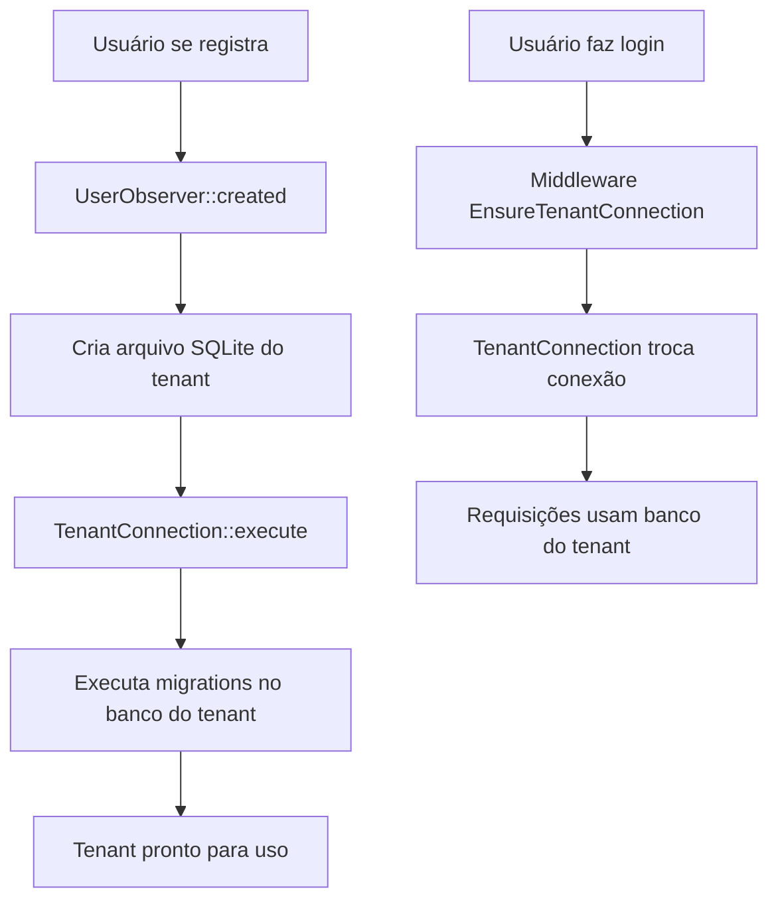

# Laravel Multitenancy 🏢

**Laravel Multitenancy** é uma aplicação de estudo desenvolvida em Laravel 11 que implementa o padrão de **Multi-Tenancy** (multi-inquilino) utilizando banco de dados SQLite isolado por tenant. O projeto demonstra uma arquitetura escalável onde cada usuário/tenant possui seu próprio banco de dados, garantindo isolamento total de dados e segurança.

A aplicação foi construída com o **TALL Stack** (Tailwind CSS, Alpine.js, Livewire, Laravel) e implementa automação completa: ao criar um novo usuário, o sistema automaticamente cria seu banco de dados e executa as migrations necessárias.

---

## 🚀 Funcionalidades

### Multi-Tenancy Features
* [x] **Banco de Dados Isolado por Tenant**: Cada usuário possui seu próprio arquivo SQLite
* [x] **Criação Automática de Banco**: Observer cria banco ao registrar novo usuário
* [x] **Migrations Automáticas**: Migrations do tenant são executadas automaticamente
* [x] **Conexão Dinâmica**: Middleware troca conexão do banco baseado no usuário autenticado
* [x] **Identificador Único (House)**: Campo único para identificação do tenant
* [x] **Trait TenantOwner**: Facilita modelos que pertencem ao tenant

### Sistema Base
* [x] **Autenticação Completa**: Laravel Breeze com registro, login, reset de senha
* [x] **Interface Reativa**: Livewire para componentes dinâmicos sem JavaScript
* [x] **CRUD de Leads**: Exemplo de entidade isolada por tenant
* [x] **Busca e Paginação**: Sistema de busca e paginação no componente Livewire
* [x] **Dashboard**: Painel administrativo por tenant
* [x] **Perfil de Usuário**: Edição de dados, senha e exclusão de conta

### Recursos Avançados
* [x] **Command Artisan Multi-Tenant**: Execute comandos em todos os tenants
* [x] **Action Pattern**: Lógica de negócio encapsulada
* [x] **Observer Pattern**: Automatização de tarefas ao criar/atualizar modelos
* [x] **TallStack UI**: Componentes prontos com TallStackUI

---

## 💪 Instruções para rodar localmente

### Pré-requisitos

* PHP >= 8.2
* Composer
* Node.js >= 18
* SQLite (geralmente já vem com PHP)

### Passos para rodar

1. Clone o repositório:

   ```bash
   git clone https://github.com/LucasFrts/laravel-multitenancy.git
   cd laravel-multitenancy
   ```

2. Instale as dependências do Laravel:

   ```bash
   composer install
   ```

3. Instale as dependências do frontend:

   ```bash
   npm install
   ```

4. Copie o arquivo `.env.example`:

   ```bash
   cp .env.example .env
   ```

5. Configure as variáveis de ambiente no `.env`:

   ```env
   APP_NAME="Laravel Multitenancy"
   APP_ENV=local
   APP_DEBUG=true
   APP_URL=http://localhost:8000

   DB_CONNECTION=sqlite
   ```

6. Gere a chave da aplicação:

   ```bash
   php artisan key:generate
   ```

7. Crie o banco de dados SQLite principal:

   ```bash
   touch database/database.sqlite
   ```

8. Crie a pasta para bancos dos tenants:

   ```bash
   mkdir -p database/tenanty
   ```

9. Execute as migrations principais:

   ```bash
   php artisan migrate
   ```

10. Compile os assets do frontend:

    ```bash
    npm run dev
    ```

11. Em outro terminal, inicie o servidor:

    ```bash
    php artisan serve
    ```

12. Acesse no navegador:

    ```
    http://localhost:8000
    ```

---

## 🧪 Executando os Testes

A aplicação utiliza **Pest PHP** para testes:

```bash
# Rodar todos os testes
php artisan test

# Rodar com cobertura
php artisan test --coverage

# Rodar testes específicos
php artisan test --filter=UserTest
```

### Lint e Formatação

```bash
# Executar o Pint (Laravel Code Style)
./vendor/bin/pint

# Verificar sem aplicar mudanças
./vendor/bin/pint --test
```

---

## 🏗️ Arquitetura do Projeto

### Estrutura de Multi-Tenancy

O projeto implementa **Multi-Tenancy por Banco de Dados**, onde cada tenant possui seu próprio arquivo SQLite:

```
database/
├── database.sqlite           # Banco principal (usuários)
└── tenanty/
    ├── house-1.sqlite        # Banco do tenant 1
    ├── house-2.sqlite        # Banco do tenant 2
    └── ...
```

### Fluxo de Funcionamento



### Componentes Principais

```
app/
├── Actions/
│   └── TenantConnection.php         # Troca conexão do banco para tenant
├── Console/Commands/
│   └── Tenant.php                   # Command para executar em múltiplos tenants
├── Http/
│   ├── Controllers/                 # Controllers padrão Laravel
│   └── Middleware/
│       └── EnsureTenantConnection.php  # Garante conexão correta
├── Livewire/
│   └── LeadComponent.php            # Componente reativo de Leads
├── Models/
│   ├── Tenant/
│   │   └── Lead.php                 # Model que usa banco do tenant
│   ├── Traits/
│   │   └── TenantOwner.php          # Trait para models do tenant
│   └── User.php                     # Model principal (banco central)
└── Observers/
    ├── UserObserver.php             # Automação na criação de usuários
    └── LeadObserver.php

database/migrations/
├── 0001_01_01_000000_create_users_table.php  # Migração principal
└── tenant/
    └── 2024_03_19_221247_create_leads_table.php  # Migração do tenant
```

---

## 🔧 Componentes Técnicos

### 1. TenantConnection (Action)

Responsável por trocar a conexão do banco de dados para o tenant específico:

```php
public function execute(): void
{
    DB::purge('tenant');
    config()->set('database.connections.tenant.database', $this->user->database());
    DB::reconnect('tenant');
}
```

**Como funciona:**
1. Limpa a conexão atual do tenant
2. Atualiza a configuração com o caminho do banco do tenant
3. Reconecta usando a nova configuração

### 2. EnsureTenantConnection (Middleware)

Garante que todas as requisições autenticadas usem o banco correto:

```php
public function handle(Request $request, Closure $next): Response
{
    app(TenantConnection::class, [
        'user' => $request->user()
    ])->execute();
    
    return $next($request);
}
```

### 3. UserObserver

Automatiza a criação da infraestrutura do tenant:

```php
public function created(User $user): void
{
    // Cria arquivo SQLite
    file_put_contents($user->database(), "");
    
    // Conecta ao banco do tenant
    app(TenantConnection::class, ['user' => $user])->execute();
    
    // Executa migrations do tenant
    Artisan::call('migrate --path=database/migrations/tenant --database=tenant');
}
```

### 4. TenantOwner (Trait)

Facilita a criação de models que devem usar o banco do tenant:

```php
trait TenantOwner
{
    public function getConnectionName()
    {
        return 'tenant';
    }
}
```

**Uso:**
```php
class Lead extends Model
{
    use HasFactory, TenantOwner;  // Automaticamente usa conexão 'tenant'
}
```

### 5. Tenant Command

Permite executar comandos Artisan em múltiplos tenants:

```bash
# Executar em todos os tenants
php artisan command:tenant migrate:status

# Executar em tenant específico
php artisan command:tenant migrate:status --tenant=1

# Seed em todos os tenants
php artisan command:tenant db:seed --class=LeadSeeder
```

---

## 📊 Estrutura de Dados

### Banco Principal (database.sqlite)

#### Tabela: users
```php
Schema::create('users', function (Blueprint $table) {
    $table->id();
    $table->string('house')->unique();           // Identificador do tenant
    $table->string('name');
    $table->string('email')->unique();
    $table->timestamp('email_verified_at')->nullable();
    $table->string('password');
    $table->rememberToken();
    $table->timestamps();
});
```

### Banco do Tenant (database/tenanty/{house}.sqlite)

#### Tabela: leads
```php
Schema::create('leads', function (Blueprint $table) {
    $table->id();
    $table->string('name');
    $table->string('email');
    $table->string('phone');
    $table->timestamps();
});
```

---

## 🎨 Frontend e Interface

### TALL Stack

O projeto utiliza o **TALL Stack** para o frontend:

* **Tailwind CSS**: Framework CSS utility-first
* **Alpine.js**: Framework JavaScript leve e reativo
* **Livewire**: Componentes reativos server-side
* **Laravel**: Backend framework

### TallStackUI

Biblioteca de componentes prontos para TALL Stack:

```blade
<x-table :headers="$headers" :rows="$rows">
    <x-slot name="header">
        <x-input wire:model.live="search" placeholder="Buscar..." />
    </x-slot>
</x-table>
```

### Componente Livewire de Exemplo

```php
class LeadComponent extends Component
{
    use WithPagination;

    public ?int $quantity = 10;
    public ?string $search = null;

    public function render(): View
    {
        return view('livewire.lead-component', [
            'rows' => Lead::query()
                ->when($this->search, function (Builder $query) {
                    return $query->where('name', 'like', "%{$this->search}%");
                })
                ->paginate($this->quantity)
        ]);
    }
}
```

---

## 🔒 Segurança e Isolamento

### Isolamento de Dados

* **Banco Separado**: Cada tenant possui banco físico isolado
* **Sem Cross-Tenant**: Impossível acessar dados de outro tenant acidentalmente
* **Middleware de Proteção**: Garante conexão correta em toda requisição

### Identificação do Tenant

O campo `house` é único e serve como identificador:

```php
public function database()
{
    return database_path("tenanty/{$this->house}.sqlite");
}
```

### Boas Práticas

* ✅ Sempre use a trait `TenantOwner` em models do tenant
* ✅ Migrations do tenant devem ficar em `database/migrations/tenant/`
* ✅ Use o middleware `EnsureTenantConnection` em rotas protegidas
* ✅ Teste comandos no tenant específico antes de executar em todos

---

## 🛠️ Tecnologias Utilizadas

### Backend
* **Laravel 11** - Framework PHP moderno
* **PHP 8.2+** - Linguagem de programação
* **SQLite** - Banco de dados leve e eficiente

### Autenticação
* **Laravel Breeze** - Starter kit de autenticação
* **Laravel Sanctum** - Autenticação de API (incluído)

### Frontend
* **Livewire 3** - Componentes reativos full-stack
* **Alpine.js** - JavaScript reativo e minimalista
* **Tailwind CSS 3** - Framework CSS utility-first
* **TallStackUI** - Componentes UI prontos
* **Vite** - Build tool moderna e rápida

### Desenvolvimento
* **Pest PHP** - Framework de testes moderno
* **Laravel Pint** - Formatador de código PHP
* **Laravel Sail** - Ambiente Docker (opcional)

---

## 📖 Conceitos de Multi-Tenancy

### O que é Multi-Tenancy?

Multi-tenancy é um padrão arquitetural onde uma única instância da aplicação serve múltiplos clientes (tenants), mantendo seus dados isolados e seguros.

### Tipos de Multi-Tenancy

#### 1. **Banco por Tenant** (implementado neste projeto)
✅ **Vantagens:**
- Isolamento total de dados
- Fácil backup por cliente
- Escalabilidade horizontal
- Segurança máxima
- Personalização por tenant

❌ **Desvantagens:**
- Mais recursos de armazenamento
- Migrations em múltiplos bancos
- Backup mais complexo

#### 2. **Schema por Tenant**
- Um banco, múltiplos schemas
- Isolamento médio

#### 3. **Tabela Compartilhada**
- Coluna `tenant_id` em cada tabela
- Menos isolamento

### Quando usar cada abordagem?

**Banco por Tenant** (este projeto):
- SaaS B2B com clientes pagantes
- Necessidade de compliance/regulação
- Requisitos de backup individual
- Customizações por cliente

**Schema por Tenant**:
- Muitos tenants (centenas)
- PostgreSQL disponível
- Menor overhead de recursos

**Tabela Compartilhada**:
- Muitos tenants pequenos (milhares)
- Dados similares entre tenants
- Performance crítica

---

## 🎯 Casos de Uso

### Exemplos de Aplicações

1. **Sistema de CRM Multi-Empresa**
   - Cada empresa tem seu banco
   - Leads isolados por empresa
   - Relatórios independentes

2. **Sistema de Gestão Escolar**
   - Uma instância para múltiplas escolas
   - Dados de alunos isolados
   - Notas e frequências separadas

3. **Plataforma de E-commerce White Label**
   - Cada loja tem banco próprio
   - Produtos e pedidos isolados
   - Personalização por loja

4. **Sistema de Tickets/Helpdesk**
   - Empresas clientes isoladas
   - Tickets e atendimentos separados
   - SLA por cliente

---

## 🧐 Processo de Desenvolvimento

O projeto foi desenvolvido com foco educacional, demonstrando:

1. **Arquitetura Multi-Tenant**: Implementação prática do padrão
2. **Automação**: Uso de Observers para tarefas automáticas
3. **Action Pattern**: Encapsulamento de lógica de negócio
4. **TALL Stack**: Stack moderna para Laravel
5. **Clean Code**: Código organizado e documentado

### Desafios Técnicos

* **Troca Dinâmica de Conexão**: Implementar middleware que troca banco sem impacto
* **Automação Completa**: Criar banco e migrations automaticamente
* **Command Multi-Tenant**: Executar comandos em múltiplos bancos
* **Trait Reutilizável**: Facilitar criação de novos models do tenant

---

## 📚 Como Adicionar Novos Modelos ao Tenant

### Passo 1: Criar a Migration no Diretório Tenant

```bash
# A migration deve ser criada manualmente em database/migrations/tenant/
touch database/migrations/tenant/2024_01_01_000000_create_invoices_table.php
```

```php
<?php

use Illuminate\Database\Migrations\Migration;
use Illuminate\Database\Schema\Blueprint;
use Illuminate\Support\Facades\Schema;

return new class extends Migration
{
    public function up(): void
    {
        Schema::create('invoices', function (Blueprint $table) {
            $table->id();
            $table->string('number')->unique();
            $table->decimal('total', 10, 2);
            $table->timestamps();
        });
    }

    public function down(): void
    {
        Schema::dropIfExists('invoices');
    }
};
```

### Passo 2: Criar o Model com TenantOwner

```php
<?php

namespace App\Models\Tenant;

use App\Models\Traits\TenantOwner;
use Illuminate\Database\Eloquent\Model;

class Invoice extends Model
{
    use TenantOwner;  // Essencial para usar banco do tenant

    protected $fillable = ['number', 'total'];
}
```

### Passo 3: Executar Migration em Todos os Tenants

```bash
php artisan command:tenant "migrate --path=database/migrations/tenant --database=tenant"
```

### Passo 4: Usar o Model

```php
use App\Models\Tenant\Invoice;

// Cria invoice no banco do tenant autenticado
Invoice::create([
    'number' => 'INV-001',
    'total' => 1500.00
]);

// Busca invoices do tenant
$invoices = Invoice::all();
```

---

## ⚠️ Limitações e Melhorias Futuras

### Limitações Conhecidas

* ⚠️ SQLite tem limitações de concorrência
* ⚠️ Sem interface para administração global
* ⚠️ Backup deve ser feito manualmente
* ⚠️ Sem limite de tamanho por tenant
* ⚠️ Não implementa soft delete de tenants
* ⚠️ Command tenant não tem progress bar

### Roadmap de Melhorias

* [ ] Interface de super-admin para gerenciar tenants
* [ ] Comando de backup automático de tenants
* [ ] Suporte a MySQL/PostgreSQL além de SQLite
* [ ] Sistema de quotas por tenant (storage, usuários)
* [ ] Logs segregados por tenant
* [ ] Métricas e analytics por tenant
* [ ] API para gerenciamento de tenants
* [ ] Soft delete de tenants com arquivamento
* [ ] Migração entre bancos de tenants
* [ ] Importação/exportação de dados por tenant
* [ ] Testes automatizados para multi-tenancy
* [ ] Documentação API com Swagger
* [ ] CI/CD com GitHub Actions
* [ ] Docker Compose para desenvolvimento

---

## 🚀 Deploy

### Considerações para Produção

#### 1. **Banco de Dados**

Para produção, considere usar **MySQL** ou **PostgreSQL** em vez de SQLite:

```env
# .env
DB_CONNECTION=mysql
DB_HOST=127.0.0.1
DB_PORT=3306
DB_DATABASE=multitenancy_main
```

Atualize `config/database.php`:

```php
'tenant' => [
    'driver' => 'mysql',
    'host' => env('DB_HOST', '127.0.0.1'),
    'database' => null,  // Será definido dinamicamente
    'username' => env('DB_USERNAME'),
    'password' => env('DB_PASSWORD'),
],
```

Atualize o método `database()` em `User.php`:

```php
public function database()
{
    return "tenant_{$this->house}";
}
```

#### 2. **Servidor Web**

Configure Nginx ou Apache conforme documentação Laravel.

#### 3. **Queue e Jobs**

Para processos assíncronos:

```bash
php artisan queue:work
```

#### 4. **Scheduler**

Adicione ao crontab:

```bash
* * * * * cd /path-to-your-project && php artisan schedule:run >> /dev/null 2>&1
```

#### 5. **Cache**

Use Redis para performance:

```env
CACHE_DRIVER=redis
SESSION_DRIVER=redis
```

---

## 💡 Exemplos de Uso

### Criar um Tenant Programaticamente

```php
use App\Models\User;
use Illuminate\Support\Str;

$user = User::create([
    'name' => 'Acme Corp',
    'house' => Str::slug('Acme Corp'),  // 'acme-corp'
    'email' => 'admin@acme.com',
    'password' => bcrypt('password')
]);

// Observer automaticamente:
// 1. Cria database/tenanty/acme-corp.sqlite
// 2. Executa migrations do tenant
```

### Acessar Dados de um Tenant Específico

```php
use App\Models\User;
use App\Actions\TenantConnection;
use App\Models\Tenant\Lead;

$user = User::find(1);

app(TenantConnection::class, ['user' => $user])->execute();

$leads = Lead::all();  // Leads do tenant específico
```

### Executar Seeds em Todos os Tenants

```bash
php artisan command:tenant "db:seed --class=LeadSeeder --database=tenant"
```

---

## 🤝 Contribuindo

Contribuições são bem-vindas! Para contribuir:

1. Fork o projeto
2. Crie uma branch para sua feature (`git checkout -b feature/MinhaFeature`)
3. Commit suas mudanças (`git commit -m 'feat: Adiciona MinhaFeature'`)
4. Push para a branch (`git push origin feature/MinhaFeature`)
5. Abra um Pull Request

### Padrões de Código

* Siga o **Laravel Code Style** (use `./vendor/bin/pint`)
* Escreva testes com **Pest PHP**
* Documente novas features
* Mantenha commits atômicos e descritivos

---

## 📄 Licença

Este projeto é open source e está disponível sob a licença MIT.

---

## 👨‍💻 Autor

Desenvolvido como projeto de estudo para demonstrar habilidades em:
* Arquitetura Multi-Tenant
* Laravel Framework avançado
* TALL Stack
* Padrões de projeto (Observer, Action)
* Automação de tarefas

---

## 📞 Recursos Úteis

### Documentação

* [Laravel 11 Documentation](https://laravel.com/docs/11.x)
* [Livewire 3 Documentation](https://livewire.laravel.com/docs)
* [TallStackUI Documentation](https://tallstackui.com)
* [Tailwind CSS](https://tailwindcss.com/docs)
* [Alpine.js](https://alpinejs.dev)

### Artigos sobre Multi-Tenancy

* [Laravel Multi-Tenancy: Database per Tenant](https://tenancyforlaravel.com)
* [Multi-Tenancy Architecture Patterns](https://docs.microsoft.com/azure/architecture/patterns/multitenancy)

---

## 🙏 Agradecimentos

* **Laravel Community** - Framework incrível
* **Livewire Team** - Reatividade sem JavaScript
* **TallStackUI** - Componentes prontos
* **Tailwind Labs** - CSS utility-first

---

**Laravel Multitenancy** - Isolamento de dados com elegância! 🏢✨
